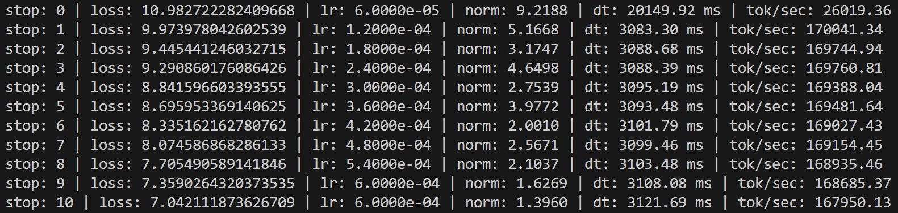
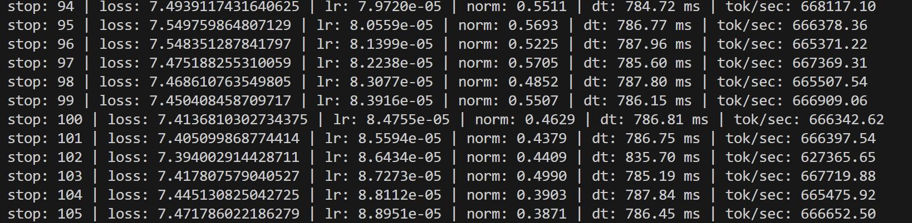
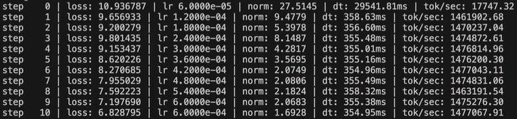

# 手搓GPT-2后感

## 前传

在开始找实习的那段时间，正要准备简历。在写简历的时候感觉自己的简历又空又大，很怕在面试的时候突然被问到项目的经历的细节，于是突发奇想，干脆手搓一个GPT-2加到项目经历里面，让简历看起来更加充实一些，这样在和面试官吹壳子的时候也有的聊，于是就在各种忙碌中（虽然不知道在忙什么）挤出时间开始了这次耗时一个月的手搓GPT-2。我是看到有知乎推荐哔哩哔哩上[【精译⚡从零开始构建 GPT 系列】Andrej Karpathy](https://www.bilibili.com/video/BV11yHXeuE9d/?spm_id_from=333.1007.top_right_bar_window_default_collection.content.click&vd_source=2b45210fbb18901823e926bd86bb251d)的教程，于是跟着这个教程开始从零构建GPT-2，总耗时在60h左右（仅供参考，我是一步一步跟着写的，所以耗时在视频长度的三倍左右）。


## Step 1 micrograd

这是一个很好的开头，教我们从零实现一个反向传播的小例子，让我完全理解了 pytorch 中`loss.backword()`的底层是如何实现的。

虽然我之前写过 pytorch，但对反向传播的底层实现方法完全属于是一知半解的状态，大概知道这样做就能完成反向传播，但是不知道在底层具体发生了什么，具体是如何传播的。通过micrograd这个例子，我知道了原来`torch.tensor`的所有运算都会通过tensor实体中对运算的规则的改写构建出一条运算传播链，在计算所有参数的梯度时，**通过这条以`loss`为终点的链条开始用微分中的链式法则反向传播梯度。**

这是从底层开始了解 pytorch 的第一步，也是理解如何用 pytorch构建GPT-2的第一步。这是一个很好的开始。这时候就不得不感叹Andrej Karpathy 的神级教学思路了，从最底层的原理开始教起，光是这种教学思维就已经远超网上各种各样其他的教学了，试问有多少教学能做到这点呢，这下又不得不吐槽大学教育现状了hhh。


## Step 2 makemore

这一部分的内容很充实。

tensor在运算时的各种特性，和一些tensor运算的技巧，`W = torch.randn((s1, s2))`

1. `W.view(s3, -1)` tensor张量组织各种维度的原理，实际上在内存中tensor是一个一维的数列，但是在tensor实体中你可以把这个一维的数列看作是多维的，并且设定每一维的长度，所有维度长度的乘积必须等于该张量的总长度，`W.view(s3, -1)`就是改变了该张量的组织方式，但是不会改变其在内存中的存储方式，是最为高效的一种改变张量维度的方法

   `torch.cat((W[:x], W[x:]), dim=0)`则是创建了一个新的张量，效率低下

2. tensor在运算时的广播机制，不细说了，这个机制和numpy中的一样

torch中`nn.Module`中的各种可以直接使用的模型的构建原理，比如`nn.Linear`、`nn.LayerNorm`等，还有`Functional`中的`F.*`

1. 线性层的初始化，主要目的是让经过线形成得到的结果能够符合正态分布，具体可能和激活函数的范围有关（参考tanh）
2. 层归一化和批归一化
3. softmax， softmax中温度的概念
4. 对数似然

最重要的就是各种调参和观察结果的技巧：

1. plt作图观察loss的变化，梯度的分布图，权重的分布（理想的分布是符合正态分布，均值可以不为0）

2. 动态调整学习率，找到最合适的学习率

   * 先试出学习率的可能区间
   * 根据区间设置一个合适的训练步数（尽量多），更据这个步数线性变化学习率（从最小到最大值）
   * plt作图观察loss，图中loss最低点对应的学习率大致就是最合适的学习率

   

## Step 3 NonaGPT

### Self-Attention

1. embedding 和 位置编码

   embedding将一个空间的向量映射到另一个空间，将token映射到另一个空间中，让意思相近的token在空间中的距离更近

   位置编码 position embedding，一个句子中token有前后顺序，因此需要对其位置进行编码，让模型知道其前后关系

   在nonaGPT中，一个字母就是一个token，因此这里将ascii码作为其token序号

2. 自注意力机制

   1. query vector ： 代表我在寻找什么？
   2. key vector：代表我包含什么
   3. value vector：代表我本身的意义

   $$
   \text{softmax}(Q  K) ---> \text{代表自己和其他 token 的关系}
   $$

   然后乘上V
   $$
   \text{softmax}(Q  K)  V ---> \text{代表自己在这个句子中获得的注意力}
   $$
   再压缩一下，让数值更稳定，主要是维持分布的稳定性，可以有效防止梯度爆炸
   $$
   \text{softmax}(\frac{Q  K}{\sqrt{d}})  V
   $$
   （大部分缩放操作都是为了维持分布的稳定性，让方差稳定在 1 左右，这样可以有效防止梯度消失或者爆炸）

3. 多头自注意力机制

   ```python
   k = k.view(B, T, self.n_head, C//self.n_head).transpose(1, 2)
   q = q.view(B, T, self.n_head, C//self.n_head).transpose(1, 2)
   v = v.view(B, T, self.n_head, C//self.n_head).transpose(1, 2)
   ```

   将注意力分散为多个头，让不同的头去注意不同的部分

4. 多头掩码自注意力机制

   NonaGPT在做的事情是预测下一个token，因此在训练的时候，当前token只能得知其与其之前token的关系，而不能得到未来的token，因此加上了掩码的机制

   ```python
   att = q @ k.transpose(-2, -1) * (1.0 / math.sqrt(k.size(-1)))
   att = att.masked_fill(self.bias[:,:,:T,:T]==0, float('-inf'))  # masked
   att = F.softmax(att, dim=-1)
   ```

5. nonaGPT的结构（其实这里可以做个简单的图，但是有点懒了，具体可以参考[GPT结构可视化网站](https://studyingfather.com/archives/841#)）

   ```python
   self.token_embding_table = nn.Embedding(vocab_size, n_embd)
   self.position_embding_table = nn.Embedding(block_size, n_embd)
   self.blocks = nn.Sequential(*[Block(n_embd, n_head=n_head) for _ in range(n_layer)])
   self.ln_f = nn.LayerNorm(n_embd)
   self.lm_head = nn.Linear(n_embd, vocab_size)
   ```

   Block的结构：一个多头注意力块 + 一个前馈层 + 两个层归一化

   ```python
   self.ln1 = nn.LayerNorm(n_embd)
   self.sa = MultiHeadAttention(n_head, head_size)
   self.ffwd = FeedForward(n_embd)
   self.ln2 = nn.LayerNorm(n_embd)
   ```

   Block 的前向传播（残差网络）：

   ```python
   def forward(self, x):
       x = self.c_fc(x)
       x = self.gelu(x)
       x = self.c_proj(x)
       return x
   ```

   


## Step Final GPT-2

### Build GPT-2

有了前面构建nonaGPT的经验，GPT-2的构建就显得尤为简单

但是在这之前，我们的token不再是一个字母了，因此我们需要了解什么是tokenization

1. tokenization：GPT系列中tokenization的基本原理是**BPE(Pair Byte Encode)**

   BPE模型的训练过程：

   1. 找出训练文本中出现最频繁的字节对（可以理解为字母对）
   2. 将该字节对从新编码成一个新的token，例如`xy = Z`
   3. 将文本中所有该字节对替换成该token，接着上面的例子就是将所有的`xy`替换成`Z`
   4. 回到第一步，如此循环往复

   这里可以观察到传统BPE的一个漏洞，如果一直循环下去的话，最终该文本会被编码为一个token，因此对传统的BPE进行了优化。

   将文本以空格进行切分，切分成很多的代码块，合并只能发生在同一代码块中，在统计最频繁出现的字节对时也不能跨块统计，在进行完预期步数的训练之后，能将出现次数频繁的单词转化为一个token

   不同的BPE模型会有不同的限制条件，比如对空格的特殊处理之类的，不同的tokenization的方式可以在很大程度上影响最后模型训练的效果。[Tiktokenizer](https://tiktokenizer.vercel.app/)

   同时tokenization也导致了许多问题。具体可以参考网上的内容。

### Optimize GPT-2 Training Efficiency

#### speed up

1. `tensor float 32`

   ```python
   torch.set_float32_matmul_precision('high') # start TF32  // 8 times better than highest(fp32) (in reality, it is 3 times better)
   ```

   

2. `bfloat16` with mixed precious:

   ```python
   with torch.autocast(device_type='cuda', dtype=torch.bfloat16): # mixed precision, some layers selectively be running by bfloat16
           logits, loss = model(x, y)
   ```

3. `torch.compile()` 在GPU缓存层面进行调优加速，重新编译model，**减少GPU与GPU缓存（HBM）之间的读写次数**

   ```python
   model = GPT(GPTConfig())
   model = model.to(device)
   model = torch.compile(model) # compile the model, make training faster, it's very useful， but it needs more compile time
   
   ```

4. `Flash attention`

   分块思想

   涉及到softmax的动态更新（在线更新）

   ```python
   # att = q @ k.transpose(-2, -1) * (1.0 / math.sqrt(k.size(-1)))
   # att = att.masked_fill(self.bias[:,:,:T,:T]==0, float('-inf'))
   # att = F.softmax(att, dim=-1)
   # y = att @ v
   y = F.scaled_dot_product_attention(q, k, v, is_causal=True) # flash attention
   ```

5. 参数的选择最好使用和 2 的次幂相关的数（这会大大提高效率）

   ```python
   #vocab_size: int = 50257
   vocab_size: int = 50304 # bring 4 percent improvement
   ```


#### train optimize

1. optimizer的超参设置（参考GPT-3）

   ```python
   optimizer = torch.optim.AdamW(model.parameters(), lr=3e-4, betas=(0.9, 0.95), eps=1e-8)
   ```

2. 限制梯度的L2范数，防止过大幅度的参数更新

   ```python
   norm = torch.nn.utils.clip_grad_norm_(model.parameters(), max_norm=1.0)
   ```

3. cosin decay for learning rate
   ```python
   max_steps = 100
   max_lr = 6e-4
   min_lr = max_lr * 0.1
   warmup_steps = 10
   max_steps = 50
   def get_lr(step):
       if step < warmup_steps:
           return max_lr * (step+1) / warmup_steps
       
       if step > max_steps:
           return min_lr
   
       decay_ratio = (step - warmup_steps)/(max_steps - warmup_steps)
       assert 0 <= decay_ratio <= 1
       coeff = 0.5 * (1.0 + math.cos(math.pi * decay_ratio))
       return min_lr + coeff * (max_lr - min_lr)
   ```

4. weight decay（权重衰减）

   同时这里的fused也能加速模型训练，在optimize的过程中，类似于将for循环遍历所有参数的操作进行压缩，一次性取出多个参数进行更新，减少读写开销

   ```python
   
   optimizer = model.configure_optimizers(weight_decay=0.1, learning_rate=6e-4, device=device)
   
   # model.configure_optimizers
   def configure_optimizers(self, weight_decay, learning_rate, device):
   
       param_dict = {pn: p for pn, p in self.named_parameters()}
       param_dict = {pn: p for pn, p in param_dict.items() if p.requires_grad}
   
       decay_params = [p for n, p in param_dict.items() if p.dim() >= 2]
       nodecay_patams = [p for n, p in param_dict.items() if p.dim() < 2]
       optim_groups = [
           {"params": decay_params, "weight_decay": weight_decay},
           {"params": nodecay_patams, "weight_decay": 0.0},
       ]
       num_decay_params = sum(p.numel() for p in decay_params)
       num_nodecay_params = sum(p.numel() for p in nodecay_patams)
       print(f"num decayed parameter tensors: {len(decay_params)}, with {num_decay_params:,} parameters")
       print(f"num non-decayed parameter tensors: {len(nodecay_patams)}, with {num_nodecay_params:,} parameters")
   
       fused_avialable = 'fused' in inspect.signature(torch.optim.AdamW).parameters
       use_fused = fused_avialable and 'cuda' in device
       print(f'using fused AdamW: {use_fused}')
       optimizer = torch.optim.AdamW(optim_groups, lr=learning_rate, betas=(0.9, 0.95), eps=1e-8, fused=use_fused)
       return optimizer
   ```


#### batch optimize

1. 通过累积的方式，在显存受限的情况下，依然能够自定义batch的大小：

   ```python
   # initial
   total_batch_size = 524288
   B = 16
   T = 1024
   assert total_batch_size % (B*T) == 0, "batch size must be divisible by B*T"
   grad_accum_steps = total_batch_size // (B*T)
   print(f"total desired batch size:{total_batch_size}")
   print(f"=> gradient accumulation steps:{grad_accum_steps}")
   
   dataloader = DataLoaderLite(B=B, T=T) # batch size reference to the gpu memory
   
   
   # train:
   for ...
      ...
       for micro_step in range(grad_accum_steps):
           x, y = dataloader.next_batch()
           x, y = x.to(device), y.to(device)
           with torch.autocast(device_type='cuda', dtype=torch.bfloat16): # mixed precision, some layers selectively be running by bfloat16
               logits, loss = model(x, y)
           loss = loss / grad_accum_steps
           loss.backward()
      ...
   ```

   

#### DistributedDataParallel

1. 多卡并行，用的是实验室的四张A800，远比教程中8张A100的平均性能差

   通过对比发现A800的并行性能远远比A100的性能差，**主要原因是A800的多卡并行通信被阉割过**

   1 张 A800 vs 4 张 A800

   1 张 A800：

   

   4 张 A800：（性能提升400%左右）

   

   

   8 张 A100：（性能提升900%， 差距显著， 遥遥领先）
   
   


#### 数据集

1. **red pajama data set**
2. **FineWeb data set**
   * FineWeb-edu：sample-10BT